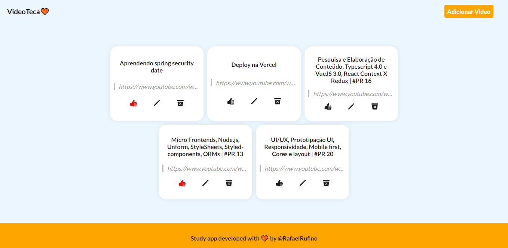
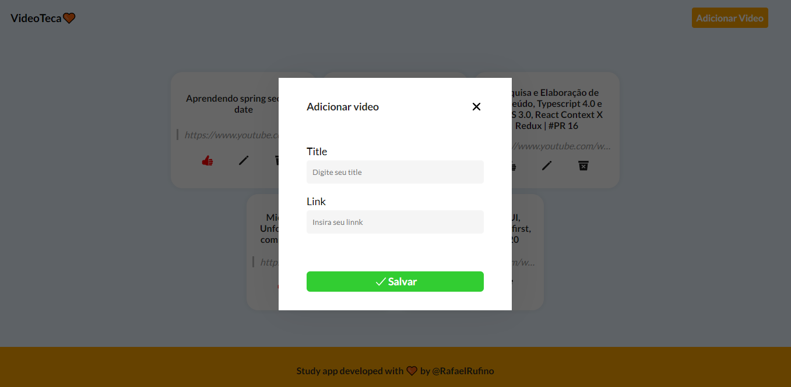

<h1 align="center" style = "color: red;">
    <b style ="color:red;">VideoTeca🧡</b>
 <br><br>
    <b>Projeto para Armazenar Videos</b><br>

</h1>

<br><br>
Acessar API
<br><br>
<a href="https://github.com/Rafael-Rufino/Api_VideoTeca.git" target="_blank">Back-End</a>

## :bookmark: Sobre

O <strong>VideoTeca</strong> é uma aplicação Web voltada para Armazenar videos.
<br>

## Conceitos aprendido

### Context API

### SWR: React Hooks for Data Fectching

### hooks

### Consumo de API

### Criação de Modal

### Styled components

## :heavy_check_mark: :computer:Resultado WEB

<br><br>

<h1 align="center">
    
</h1>

<br/>
<h1 align="center">
    
</h1>

<p align="center">
  <a href="#sobre">Projeto</a>&nbsp;&nbsp;&nbsp;|&nbsp;&nbsp;&nbsp;
  <a href="#tecnologias-utilizadas">Tecnologias</a>&nbsp;&nbsp;&nbsp;|&nbsp;&nbsp;&nbsp;
  <a href="#como-usar">Como Usar</a>&nbsp;&nbsp;&nbsp;|&nbsp;&nbsp;&nbsp;
  <a href="#Como-Contribuir">Como Contribuir</a>
 
 
</p>

<p align="center">
 

  
</p>

<br>

<a id="sobre"></a>

<a id="tecnologias-utilizadas"></a>

## :rocket: Tecnologias Utilizadas

O projeto foi desenvolvido utilizando as seguintes tecnologias

- [React](https://pt-br.reactjs.org/)
- [Nodejs](https://www.typescriptlang.org/)
- [Mogodb](https://firebase.google.com/docs)

<br>

<a id="como-usar"></a>

## :fire: Como usar

- ### **Pré-requisitos**

  - É **necessário** possuir o **[Node.js](https://nodejs.org/en/)** instalado na máquina
  - Também, é **preciso** ter um gerenciador de pacotes seja o **[NPM](https://www.npmjs.com/)** ou **[Yarn](https://yarnpkg.com/)**.

1. Faça um clone :

```sh
  Front-End
  git clone https://github.com/Rafael-Rufino/VideoTeca.git

  Back-End
  git clone https://github.com/Rafael-Rufino/Api_VideoTeca.git
```

2. Executando a Aplicação:

```sh
  # Instale as dependências
  $ npm install
  #ou
  $ yarn


  # Inicie a aplicação web
  $ cd videoteca
  $ npm run start
  # ou
  $ yarn start


  # Acessar o Servidor no Navegador
  $ http://127.0.0.1:3000/

  # Porta de Acesso Liberado
  $ 3000


```

<a id="Como-Contribuir"></a>

## :recycle: Como contribuir

- Faça um Fork desse repositório,
- Crie uma branch com a sua feature: `git checkout -b my-feature`
- Commit suas mudanças: `git commit -m 'feat: My new feature'`
- Push a sua branch: `git push origin my-feature`

🎓 **Quem ministrou?**

As aulas foram ministradas pelo mestre
Huriel - Instructor - Youtube

📝 **License**

Esse projeto está sob a licença MIT. Veja o arquivo [LICENSE](LICENSE.md) para mais detalhes.

<h4 align="center">
    Feito com 💜 by <a href="https://www.linkedin.com/in/rafael-r-dos-santos-b889311ba/" target="_blank">Rafael Rufino</a>
</h4>
